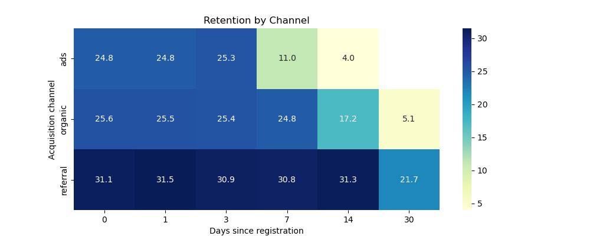

# 📊 Анализ удержания пользователей в подписочном сервисе

## 📌 Описание проекта

В рамках проекта проведён анализ поведения пользователей подписочного сервиса с целью выявления проблем удержания и оценки качества каналов привлечения.

Проект моделирует реальную продуктовую задачу: пользователи приходят в сервис, но часть из них быстро перестаёт пользоваться продуктом. Необходимо определить причины оттока и предложить решения для бизнеса.

---

## 🎯 Цели анализа

* Рассчитать retention пользователей
* Сравнить удержание по каналам привлечения
* Выявить проблемные сегменты (early churn)
* Сформулировать продуктовые гипотезы
* Оценить финансовую эффективность каналов (unit-экономика)
* Подготовить рекомендации для бизнеса

---

## 📂 Данные

Использованы синтетические данные, смоделированные с учетом реальных продуктовых паттернов поведения пользователей.

### Структура данных:

**users**

* user_id — идентификатор пользователя
* registration_date — дата регистрации
* acquisition_channel — канал привлечения (ads / organic / referral)

**events**

* user_id
* event_date
* event_type (watch)

**subscriptions**

* user_id
* subscription_length — длительность подписки
* churned — факт оттока

---

## ⚙️ Особенности данных

В данных заложены различия между каналами:

* **ads** — низкое качество трафика, высокий early churn
* **organic** — среднее поведение
* **referral** — высокая вовлеченность и удержание

Также реализована сегментация пользователей:

* early churn
* normal
* loyal

---

## 🧮 Методология

Retention рассчитывался как доля пользователей, совершивших событие (watch) на N-й день после регистрации:

**Retention(N) = Users_active_on_day_N / Users_in_cohort**

Анализ проводился:

* по когортам
* по каналам привлечения
* на ключевых днях: 0, 1, 3, 7, 14, 30

---

## 📊 Визуализация retention

---

## 🔥 Ключевые инсайты

* Канал **ads** демонстрирует выраженный early churn — основной отток происходит в первые 3–7 дней
* Канал **referral** показывает наиболее стабильное удержание и высокую вовлеченность
* Основной отток пользователей происходит в первые дни после регистрации
* Канал **organic** демонстрирует стабильное поведение с постепенным снижением активности

---

## 📊 Основные результаты

### 📉 Канал ads

* Резкое падение retention после 3–7 дня
* К 14 дню удержание снижается до минимальных значений

👉 Канал привлекает нерелевантную аудиторию

---

### 📊 Канал organic

* Стабильный retention в первые 14 дней
* Плавное снижение активности

👉 Нормальное поведение пользователей

---

### 📈 Канал referral

* Самый высокий retention
* Минимальный отток
* Долгосрочная активность пользователей

👉 Наиболее качественный канал привлечения

---

## 💰 Unit-экономика

Для оценки финансовой эффективности каналов был рассчитан средний доход на пользователя (LTV).

Допущения:

* стоимость подписки — **350 рублей за 30 дней**
* доход рассчитывается пропорционально длительности подписки

Значения стоимости привлечения (CAC) заданы условно:

* ads — 500 руб
* organic — 100 руб
* referral — 200 руб

### 📊 Результаты

| Канал    | LTV (руб) | CAC (руб) | LTV/CAC |
| -------- | --------- | --------- | ------- |
| ads      | 160       | 500       | 0.32    |
| organic  | 364.56    | 100       | 3.65    |
| referral | 703.54    | 200       | 3.52    |

---

## 🔍 Интерпретация результатов

Канал **ads** демонстрирует высокий early churn и низкую вовлеченность пользователей, а также отрицательную unit-экономику (LTV/CAC < 1).

Это может свидетельствовать о:

* нерелевантном таргетинге
* несоответствии рекламного сообщения продукту
* низкой мотивации пользователей

Каналы **organic** и **referral**, напротив, показывают устойчивое удержание и положительную экономику.

---

## 💡 Рекомендации

* Пересмотреть стратегию привлечения в канале **ads**
* Провести A/B тестирование рекламных кампаний
* Улучшить onboarding пользователей
* Увеличить инвестиции в канал **referral**
* Перераспределить маркетинговый бюджет в пользу эффективных каналов

---

## 📎 Вывод

Канал **ads** не только показывает низкий retention, но и является убыточным с точки зрения unit-экономики.

Каналы **organic** и **referral** обеспечивают устойчивое удержание пользователей и положительную финансовую эффективность.

Таким образом, ключевая точка роста продукта — оптимизация каналов привлечения и перераспределение бюджета в пользу более эффективных источников трафика.

---

## 📊 Статистическая проверка

Проведённая статистическая проверка показала, что различия в retention между каналами (ads и referral) являются статистически значимыми (p-value << 0.05).

Это означает, что наблюдаемая разница не является случайной и обусловлена реальными различиями в качестве трафика.

В сочетании с анализом unit-экономики это позволяет сделать вывод:

канал ads не только хуже удерживает пользователей, но и является убыточным (LTV/CAC < 1).

Следовательно, проблема носит системный характер и требует управленческих решений.

Рекомендуется:
- сократить или пересмотреть инвестиции в канал ads
- перераспределить бюджет в пользу более эффективных каналов (organic, referral)
- провести дополнительный анализ качества трафика (креативы, таргетинг, источники)

📎 Код анализа: notebooks/statistical_test.ipynb

## 📎 SQL-запросы

* Cohort retention — `sql/retention_cohort.sql`
* Retention by channel — `sql/retention_by_channel.sql`
* LTV calculation — `sql/ltv_by_channel.sql`

---

## 🛠 Используемые инструменты

* SQL
* Python
* DBeaver

---

## 🚀 Дальнейшие шаги

* Статистическая проверка различий между каналами
* Анализ поведения пользователей внутри продукта
* Построение дашборда
* Расширение модели unit-экономики

---

