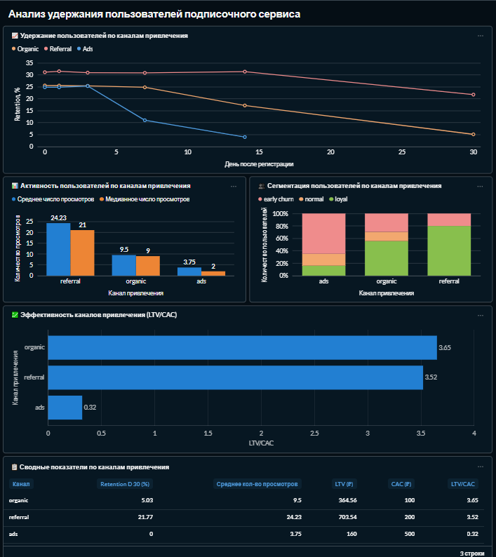
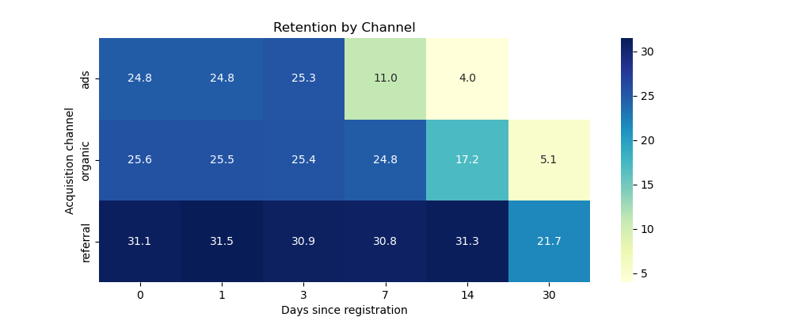

# 📊 Анализ удержания пользователей подписочного сервиса


## 📌 Executive Summary

В проекте проведён комплексный анализ удержания пользователей подписочного сервиса с использованием SQL, Python и Metabase.

В ходе исследования выполнены:

- когортный анализ Retention;
- анализ каналов привлечения;
- исследование поведения пользователей;
- сегментация аудитории;
- расчёт unit-экономики;
- статистическая проверка гипотез;
- построение аналитического дашборда.

По результатам анализа установлено, что пользователи канала **Referral** демонстрируют наиболее высокое удержание и вовлечённость, тогда как канал **Ads** характеризуется высоким ранним оттоком и отрицательной unit-экономикой.

---

## 📈 Ключевые результаты

- 📉 Канал **Ads** показал самый высокий ранний отток пользователей.
- 📈 Канал **Referral** продемонстрировал наилучшее удержание и вовлечённость.
- 💰 Наибольшее значение **LTV/CAC** получил канал **Organic** благодаря низкой стоимости привлечения.
- 📊 Статистический тест подтвердил значимость различий между каналами (*p-value < 0.05*).

---

## 🚀 Ключевые навыки, продемонстрированные в проекте

- SQL (CTE, оконные функции, агрегирование)
- Когортный анализ (Retention)
- Анализ поведения пользователей
- Сегментация пользователей
- Unit-экономика (LTV, CAC, LTV/CAC)
- Статистическая проверка гипотез (SciPy)
- Визуализация данных (Matplotlib)
- Разработка BI-дашборда (Metabase)

---

## 🎯 Бизнес-задача

Компания привлекает пользователей через несколько маркетинговых каналов, однако их эффективность существенно различается.

Цель проекта — определить:

- какие каналы привлекают наиболее качественную аудиторию;
- когда происходит основной отток пользователей;
- чем отличается поведение пользователей разных каналов;
- какие каналы наиболее эффективны с финансовой точки зрения;
- какие управленческие решения можно принять на основе полученных результатов.

---

## 📂 Структура данных

Использованы синтетические данные, моделирующие работу подписочного видеосервиса.

### users

| Поле | Описание |
|------|----------|
| user_id | идентификатор пользователя |
| registration_date | дата регистрации |
| acquisition_channel | канал привлечения |

### events

| Поле | Описание |
|------|----------|
| user_id | идентификатор пользователя |
| event_date | дата просмотра |
| event_type | watch |

### subscriptions

| Поле | Описание |
|------|----------|
| user_id | идентификатор пользователя |
| subscription_length | длительность подписки |
| churned | факт оттока |

---

## 🛠 Используемые технологии

- PostgreSQL
- SQL
- Python (pandas, SciPy, matplotlib, seaborn)
- Jupyter Notebook
- Metabase
- DBeaver
- Git
- GitHub

---

## 🔍 Этапы анализа

### 1. Когортный анализ

Рассчитан Retention пользователей по когортам регистрации.

### 2. Анализ каналов привлечения

Сравнено удержание пользователей каналов Organic, Referral и Ads.

### 3. Анализ поведения пользователей

Рассчитаны:

- среднее число просмотров;
- медианное число просмотров;
- среднее число активных дней;
- стандартное отклонение.

Помимо среднего количества просмотров была рассчитана медиана, что позволило оценить типичное поведение пользователей и снизить влияние отдельных высокоактивных пользователей на итоговые показатели.

### 4. Сегментация пользователей

Пользователи разделены на три сегмента:

- Early churn
- Normal
- Loyal

Для каждого сегмента рассчитаны ключевые показатели активности.

### 5. Unit-экономика

Для каждого канала рассчитаны:

- LTV;
- CAC;
- LTV/CAC.

Стоимость подписки принята равной **350 ₽ за 30 дней**.

### 6. Статистическая проверка

Проверена гипотеза об отсутствии различий между каналами **Ads** и **Referral**.

Полученные результаты подтвердили статистическую значимость различий (p-value < 0.05).

---

## 📊 Основные результаты

### 📈 Retention

- Основной отток пользователей происходит в первые 7 дней после регистрации.
- Канал **Referral** демонстрирует наиболее высокий уровень удержания.
- Канал **Ads** показывает резкое снижение Retention уже после третьего дня.

### 👥 Поведение пользователей

| Канал | Среднее просмотров | Медиана просмотров |
|-------|-------------------:|-------------------:|
| Referral | 24.23 | 21 |
| Organic | 9.50 | 9 |
| Ads | 3.75 | 2 |

Во всех каналах среднее число просмотров превышает медиану, что свидетельствует об асимметричном распределении пользовательской активности.

Наиболее выраженная разница наблюдается в канале **Ads**, где небольшая группа активных пользователей увеличивает среднее значение, тогда как большинство аудитории быстро прекращает пользоваться сервисом.

### 📊 Сегментация

Структура сегментов значительно различается между каналами.

Для канала **Ads** характерно преобладание пользователей сегмента **Early churn**, тогда как среди пользователей **Referral** большинство относится к сегменту **Loyal**.

### 💰 Unit-экономика

| Канал | LTV | CAC | LTV/CAC |
|-------|----:|----:|---------:|
| Ads | 160 | 500 | 0.32 |
| Organic | 364.56 | 100 | 3.65 |
| Referral | 703.54 | 200 | 3.52 |

Несмотря на более высокий LTV канала **Referral**, максимальное значение LTV/CAC показывает **Organic** благодаря значительно меньшей стоимости привлечения пользователей.

Канал **Ads** является единственным каналом с отрицательной unit-экономикой.

### 📈 Статистическая проверка

Статистический тест подтвердил, что различия в удержании пользователей каналов **Ads** и **Referral** являются статистически значимыми.

Полученные результаты согласуются с выводами когортного анализа и анализа поведения пользователей.

---

## ⚠️ Допущения и ограничения

Проект выполнен на синтетических данных.

При генерации данных были заранее заложены различия между каналами привлечения пользователей, поэтому статистическая проверка ожидаемо подтвердила наличие значимых различий.

Для расчёта unit-экономики использованы условные значения CAC, предназначенные для демонстрации подхода к оценке эффективности маркетинговых каналов.

---

## 📁 Структура проекта

```text
subscription-retention-analysis/
│
├── data/
├── images/
│   ├── dashboard.PNG
│   └── heatmap_retention.png
│
├── notebooks/
│   └── statistical_test.ipynb
│
├── sql/
│   ├── 01_retention_cohort.sql
│   ├── 02_retention_by_channel.sql
│   ├── 03_user_behavior.sql
│   ├── 04_user_segmentation.sql
│   └── 05_unit_economics.sql
│
└── README.md
```

---

## 📷 Примеры визуализации

### 📊 Dashboard

Интерактивный дашборд в Metabase объединяет результаты когортного анализа, анализа поведения пользователей, сегментации аудитории и unit-экономики.



## 🔥 Тепловая карта Retention

Для визуального анализа когорт построена тепловая карта удержания пользователей.



---

## 📌 Основные выводы

Исследование показало, что канал привлечения оказывает существенное влияние на удержание пользователей, их активность и финансовую эффективность.

Канал **Referral** обеспечивает наиболее высокое удержание пользователей и уровень вовлечённости, тогда как **Organic** демонстрирует наилучшее соотношение **LTV/CAC** благодаря низкой стоимости привлечения.

Канал **Ads** характеризуется высоким ранним оттоком пользователей и отрицательной unit-экономикой, что указывает на необходимость пересмотра стратегии привлечения.

Проект демонстрирует полный цикл аналитической работы: от подготовки данных и SQL-анализа до статистической проверки гипотез, визуализации результатов и разработки BI-дашборда.
